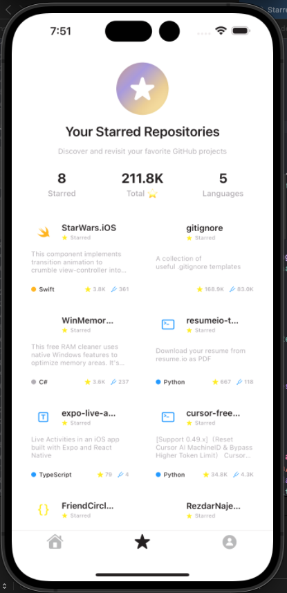
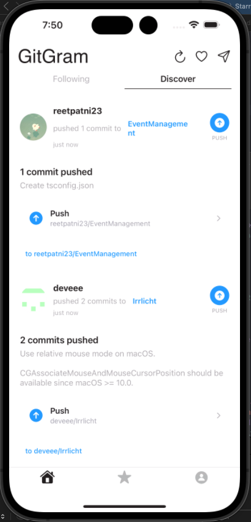
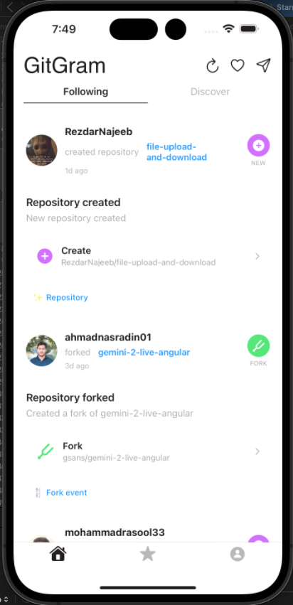
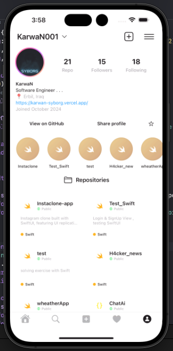

# GitGram (InstaClone) 🚀

  

## 📸 What is GitGram?  
**GitGram** is where **Instagram meets GitHub**.  
Imagine browsing GitHub data in a smooth **Instagram-like feed**.  
- Instead of photos → you scroll through **repositories** 📂  
- Instead of stories → you see **GitHub activities & news** 📰  
- Instead of likes → you count **stars ⭐**  
- Instead of followers on IG → you see your **GitHub followers & following** 👥  
All packed inside a native **SwiftUI app** with the look & feel of Instagram.  

---

## 🔥 Features  
- 🏠 **Home Feed** → Shows GitHub activity/news from your friends (commits, PRs, stars).  
- 📂 **Repos as Posts** → Your repositories displayed beautifully like Instagram posts.  
- 👥 **Followers & Following** → See who follows you (and who you follow) on GitHub.  
- 👤 **Profile Page** → Displays your GitHub profile in an Instagram-style layout.  
- 🌙 **Dark/Light Mode** → Full support for iOS system appearance.  

---

## 📷 Screenshots

| **Following Feed** | **Discover Feed** | **Starred Repositories** | **Profile Page** | **Followers List** |
|:------------------:|:-----------------:|:------------------------:|:----------------:|:------------------:|
|  |  |  |  |  |
| **Following tab showing repository activities, commits, and forks from users you follow** | **Discover tab displaying recent commits and pushes from the GitHub community** | **Your starred repositories with statistics like stars, forks, and language info** | **Profile page showing repos, followers & following count** | **Followers list with user avatars and details** |

### 🎯 App Flow Overview
- **Feed Experience**: Browse through GitHub activities just like scrolling through Instagram posts
- **Repository Discovery**: Find new repositories through the discover tab with real-time commit updates
- **Star Management**: View and manage your starred repositories with detailed statistics
- **Social Interaction**: See your GitHub social connections in a familiar Instagram-style interface
- **Real-time Updates**: Stay updated with latest commits, forks, and repository activities

---

## 🛠️ Tech Stack  
- **Language:** Swift  
- **Framework:** SwiftUI  
- **API:** [GitHub REST API](https://docs.github.com/en/rest)  
- **Platform:** iOS (Native)  

---

## 🚀 Getting Started
1. Clone this repository
2. Open the project in Xcode
4. Build and run on iOS simulator or device

---

## 🤝 Contributing
Feel free to contribute to this project! Whether it's:
- 🐛 Bug fixes
- ✨ New features  
- 📖 Documentation improvements
- 🎨 UI/UX enhancements

  <b>Made with ❤️ by combining the best of Instagram UX and GitHub functionality</b>

